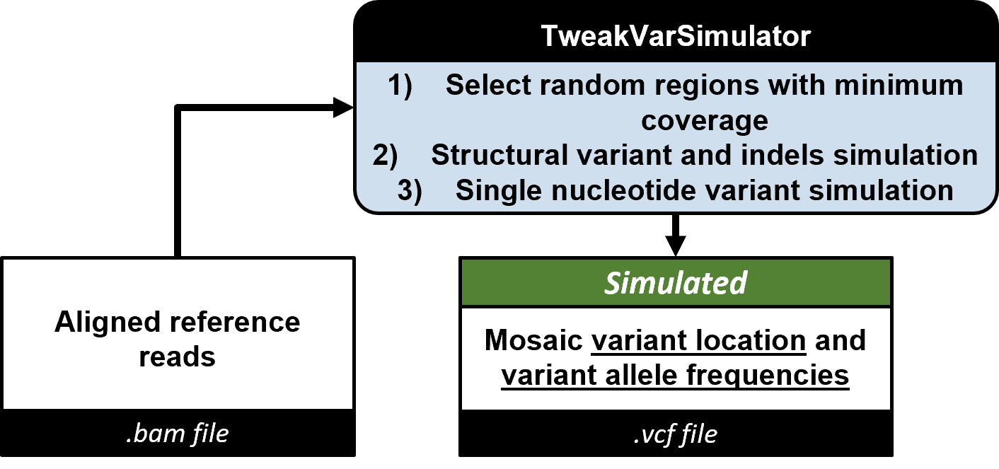
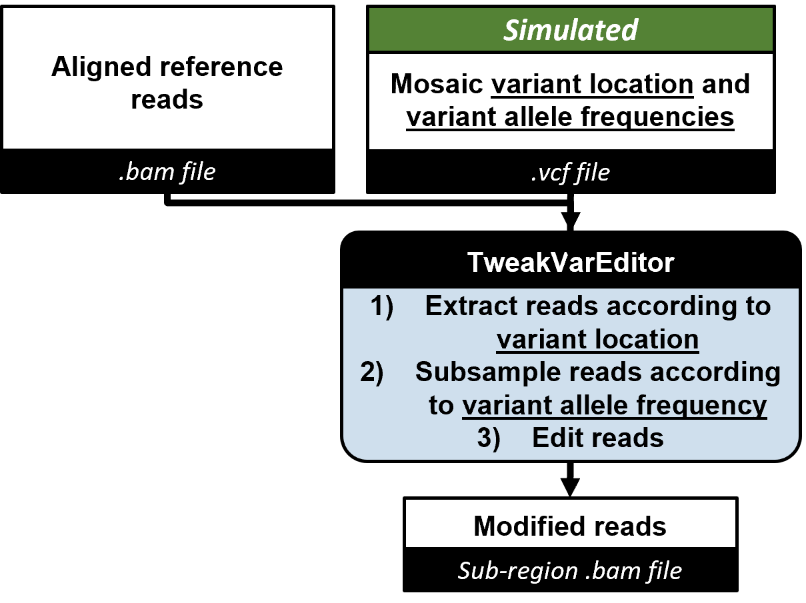
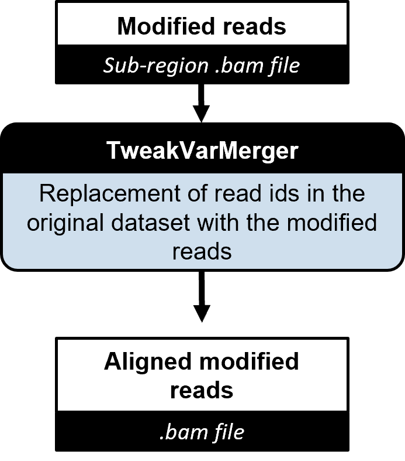
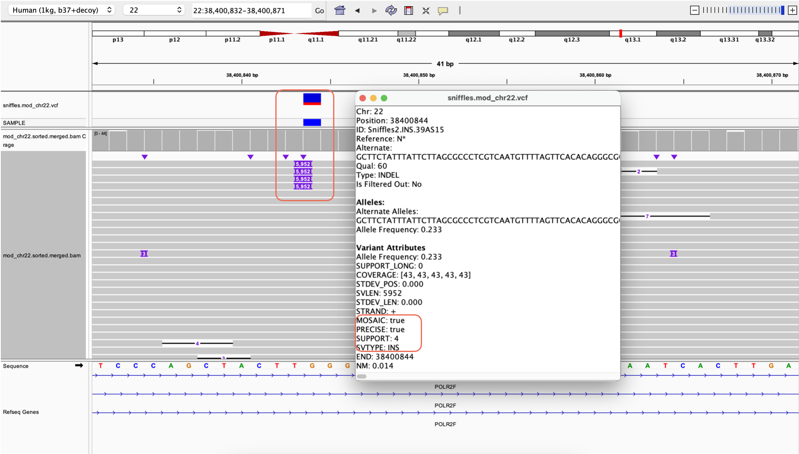
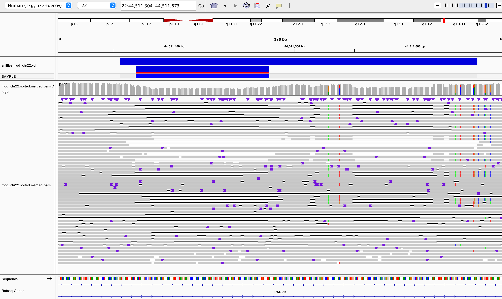
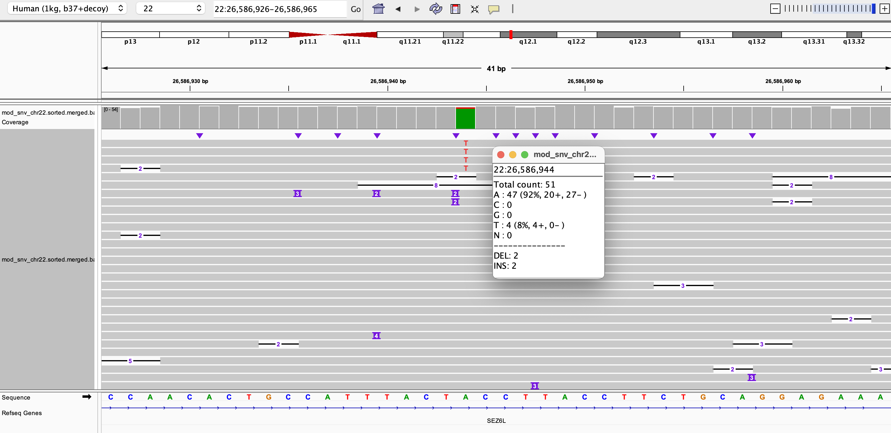
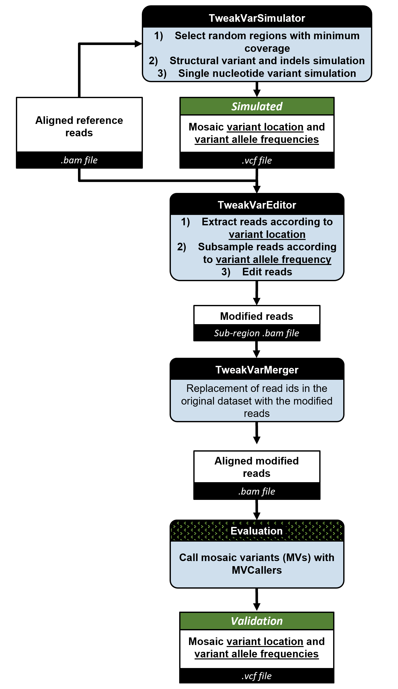

# SpikeVar & TweakVar: Simulation of Mosaic Variants in Sequencing Data

**Hackathon team: Lead: Fritz Sedlazeck - Developers: Erik Stricker, Xinchang Zheng, Michal Izydorczyk, Chi-Lam Poon, Philippe Sanio, Farhang Jaryani, Joyjit Daw, Divya Kalra, Adam Alexander - Writers: Erik Stricker, Sontosh Deb**

*We provide two simulation workflows which output sequencing read files with artificial mosaic variants and a ground truth mosaic variant annotation file for the validation of mosaic variant callers.*


## Table of Contents
|1. [Background](#background)<br>2. [Installation](#installation)<br>3. [Dependencies](#dependencies)<br>4. [Tests](#tests)<br>5. [How to Use It](#how-to-use-it)<br>6. [Example Implementation](#example-implementation)<br>7. [Method Description](#method-description)<br>8. [Contributers](#contributers)<br>9. [References](#references)<br>|<video src="https://github.com/collaborativebioinformatics/SVHack_simulatemosaic/assets/37314125/4d0dfe58-501c-4ee8-99ea-ff3411e23b4f" width="200" height="200" align="right">|
|:------|-:|


## Background


In the context of individual genome comparison, mutations that appear within a small fraction of the population are considered rare variants[<sup>1</sup>](#1). When assessing a population of cells from a tissue of the same individual in turn, rare variants only present in a small fraction of the cells are defined as mosaic variants (MVs)[<sup>2</sup>](#2). Recent studies have shown that there is potential disease associations of for certain MVs[<sup>2</sup>](#2). However, MVs are challenging to detect because they are mixed in with data from the non-mutated cells and present in the same sequencing file. Therefore, several pipelines have been developed or adjusted to extract mosaic single nucleotide, structural or indel variants from whole genome sequencing data such as Sniffles[<sup>3</sup>](#3), DeepMosaic[<sup>4</sup>](#4), Mutect2[<sup>5</sup>](#5), DeepVariant[<sup>6</sup>](#6). To benchmark and validate the efficiency and accuracy of these methods, sequencing files with known MVs are necessary. We developed two simulation workflows called SpikeVar (*Spike* in *Var*iants from a second individual) and TweakVar (*Tweak* *Var*iants within existing reads of one individual), which output sequencing read files with artificial MVs and a ground truth annotation file for the MVs. SpikeVar accomplishes this by spiking in real reads from a sample at user-defined ratio into the sequencing file from a second sample. In contrast, TweakVar creates a list of random mutations and modifies a fraction of existing reads to match the user-defined MV frequency.


## Installation
These instructions are valid for **Linux x86**. For other platforms (e.g. MacOS), instructions will need to be adapted.

Load conda, e.g.
```
module load miniconda/3
```
or (in some instances python has to be loaded to run the conda command)
```
module load anaconda3/2024.02
module load python
```

Installing two conda environments with python 3.10
```
conda create -n MosaicSim python=3.10
conda init
conda activate mosaicSim
```

Unload python if previously loaded so that python 3.10 from conda environment will be used
```
module unload python
```

Obtain the MosaicSim from github (replace $HOME with your preferred installation director)
```
cd  $HOME
git clone https://github.com/erikstricker/MosaicSim.git
```

To install the relevant python dependencies, run
```
REPO_ROOT="$HOME/MosaicSim/"

pip install -r $REPO_ROOT/requirements.txt
```
Ensure to also load mosdepth>0.3.2 (for SpikeVar), samtools >1.15.1, and bcftools>1.19

Once the requirements are installed, please install or load the following additional packages

_Installation_
```
conda install -c bioconda samtools bcftools mosdepth
```
_Loading (e.g.)_
```
export PATH=/path/to/software/mosdepth/mosdepth-0.3.2/bin:$PATH
export PATH=/path/to/software/samtools/samtools-1.21/bin:$PATH
export PATH=/path/to/software/bcftools/bcftools-1.19/bin:$PATH
```
or
```
module load mosdepth-0.3.2
module load samtools-1.21
module load bcftools-1.19
```

## Dependencies

### SpikeVar
- mosdepth 0.3.2
- samtools 1.15.1
- bcftools 1.19
- Python 3.6.8
- bcftools
  
### TweakVar
- pysam (0.21.0) 
- numpy (1.25.2)
- biopython (1.81)
- samtools 1.15.1
- bcftools 1.19

## Tests

The repository comes with unit tests to ensure correct setup and functioning of core libraries.

To run the unit tests, please execute
```
python -m pytest tests/*
```

## How to Use It

### SpikeVar

The spiked-in dataset simulates a sample with potential mosiac variants at a user-specified ratio. The re-genotyped VCFs of the samples and the VCF of the spiked-in dataset can be compared to evaluate AF < user-specified value.

#### 1) SpikeVarDatabaseCreator - Generate Spiked-in Dataset

  

In this step, x% of mutations are strategically introduced from sample A to sample B. Both datasets are down-sampled and then merged to create a mixed dataset that represents a sequence read dataset with mosaic variants, including structural variations (SVs), single nucleotide variations (SNVs), and insertions/deletions (indels). 

```
./spike-in.sh <path to sampleA.bam> <path to sampleB.bam> <spike-in ratio x/100> <path to samtools binary> <path to mosdepth binary> <output dirpath> <path to script calculate_ratio.py>
```
#### 2) SpikeVarReporter - Filter Reads After Variant Allele Frequency Recalculation

  

After creating the modified BAM file we have to re-calculate the variant allele frequency (VAF) for all variants.
First, all variants stored from both VCF files must be merged and the VAF must be recalculated. 
Depending on the variants we either start a SNV or SV caller, which can recalculate the VAF of each variant. 
For SNVs, we are using bcftools mpileup. For SVs and short read data we are using Paragraph from Illumina and for long read data Sniffles2 is used.

Last the re-genotyped VCF is filtered according to the VAF with a small Python script, which calculates the minor allele frequency (MAF) for each variant and lets a variant pass to the final output if the MAF is equal or greater than the use specified VAF.
```
./2b_re-genotyping_main.sh <VARIANT> <VAF> <sampleA.vcf> <sampleB.vcf> <sampleAandB.bam> output/path <ref.fa> <short|long>
```
#### 3) Run Your Favorite Mosaic Variant Caller and Compare Results

### TweakVar

Once the Python dependencies are installed, the scripts can be run directly from the `scripts` subfolder.

#### 0) TweakVar Prep

Before getting started ensure that:
* The input file is in bam format with corresponding index (.bai) file
* The corresponding fasta reference file is downloaded with appropriate index (.fai) file

#### 1) TweakVarSimulator - Generate Simulated VCF



The **TweakVarSimulator** generates a random set of mosaic variants, including **single nucleotide variants (SNVs)** and **structural variants (SVs)**. These variants can be customized by adjusting parameters such as **variant allele frequency (VAF)**, **the number of variants to simulate**, and **variant size**.

The output is a **VCF file in Sniffles format**, which serves as:  
- **Input** for the read editor step (described below) to modify sequencing reads by inserting the simulated variants.  
- **Ground truth** for evaluating mosaic variant callers.  

##### Usage
```bash
python tweakvarsimulator.py -i <path_to_bam> -T <path_to_ref> -o <output_path_prefix> [optional arguments]
```

##### Required Parameters  
| Parameter | Description |
|-----------|-------------|
| `-i, --input` | Path to the **input BAM file** containing sequencing reads. |
| `-T, --reference` | Path to the **reference genome FASTA file**. |
| `-o, --output` | Prefix for the **output files** (e.g., VCF files for simulated SNVs and SVs). |

##### Optional Parameters  
| Parameter | Description | Default Value |
|-----------|-------------|---------------|
| `-s, --seed` | **Random seed** for reproducibility. If not set, the results will vary between runs. | `0` |
| `-minAFsv, --minimum_allele_frequency_sv` | **Minimum allele frequency** for simulated **structural variants (SVs)**. | `0.01` |
| `-maxAFsv, --maximum_allele_frequency_sv` | **Maximum allele frequency** for **SVs**. | `0.05` |
| `-minAFsnv, --minimum_allele_frequency_snv` | **Minimum allele frequency** for **single nucleotide variants (SNVs)**. | `0.01` |
| `-maxAFsnv, --maximum_allele_frequency_snv` | **Maximum allele frequency** for **SNVs**. | `0.05` |
| `-numsv, --number_of_svs` | Number of **structural variants (SVs)** to simulate. | `50` |
| `-numsnv, --number_of_snvs` | Number of **single nucleotide variants (SNVs)** to simulate. | `200` |
| `-minsvl, --minimum_sv_length` | **Minimum length** of simulated **SVs** (in base pairs). | `50` |
| `-maxsvl, --maximum_sv_length` | **Maximum length** of simulated **SVs** (in base pairs). | `10,000` |
| `-sub, --substitution_rate` | **Probability of generating a SNP** versus an indel (in SNVs). A value of **1.0** means only SNPs will be generated. | `1.0` |
| `-insdelsnv, --insdel_snv_rate` | **Probability of generating an insertion vs. a deletion** in SNVs. A value of **0.5** means equal chances of insertion and deletion. | `0.5` |
| `-insdel, --insdel_sv_rate` | **Probability of generating an insertion vs. a deletion** in SVs. A value of **0.7** means insertions are more likely than deletions. | `0.7` |


#### 2) TweakVarEditor - Generate Edited Reads Based on Simulated VCF



This command above takes in the VCF which determines which variants to introduce into the reads.
The BAM file is used to find the reads which overlap with variant locations. Only a subset of the reads
corresponding to a particular variant location are edited. This is determined by the allele frequency.
The output BAM file retains the alignment info and now contains the edited reads. Also, the query name of each read is kept the same.

##### Usage
```bash
python tweakvareditor.py -v <simulated_vcf> -b <path_to_bam> -T <path_to_ref> -o <output_bam>
```
##### Required Parameters  
| Parameter               | Description |
|-------------------------|-------------|
| `-v, --vcf_file`         | VCF file from TweakVarSimulator  (SNV or SV). |
| `-b, --bam_file`         | Input BAM file. |
| `-T, --ref_file`         | Reference genome file for BAM. |
| `-o, --out_file`         | Output BAM file name and directory. |

##### Optional Parameters  
| Parameter | Description | Default Value |
|-----------|-------------|---------------|
| `-of, --output_format` | **Output format** can be either sorted `bam` file or unmapped `fastq` file. Fastq format has to converted into a mapped bam file with an aligner, while mapped reads in the bam file will directly replace existing reads at their original position. | `"bam"` |

#### 3) TweakVarMerger - Re-Align Modified Reads and Merge Them

Replace the reads in the original dataset with the modified reads. This step is time intensive so make sure to run it in a cluster environment for lage files.

##### Usage
```bash
python tweakvarmerger.py -b <input bam> -m <bam file with modified reads> --primary -o <out_dir>
```

##### Required Parameters  

| Parameter        | Description                                   |
|-----------------|-----------------------------------------------|
| `-b`, `--input_bam`  | Unmodified input BAM file                 |
| `-m`, `--modified_bam` | BAM file with modified reads only        |
| `-o`, `--out_file`  | Output file name (default: `tweakvar_modified.bam` in the current directory) |




#### 4) Run Your Favorite Mosaic Variant Caller and Compare Results
For SV calling, we tried Sniffles:
```
sniffles --input <MOD_MERGED_BAM> --vcf sniffles_out.vcf --mosaic --threads 8
```
* MOD_MERGED_BAM is the output bam file from `tweakvarmerger.py`

for SNV calling, we ran longshot:
```
longshot --bam <MOD_MERGED_BAM> --ref <REF> --out longshot_out.vcf --min_cov 3
```


## Example Implementation

### SpikeVar

Here, we use the SpikeVar workflow to automatically spike in sample HG002 at a 5% concentration into sample HG0733, to result in a 5% mosaic variant allele frequency (VAF). A downside is that the generated mixed .bam file will include 4 haplotype structures which cannot be corrected for. Furthermore, certain variants (e.g. HG002 variants) will not be presented at the targeted VAF. For example, heterozygous variants will not be represented by 5% VAF but rather at ~2.5% VAF. To account for this we re-genotype variants and report only variants that should be identifiable at the user-defined threshold or higher VAF.   

#### 1) Fetch Data
In order to spike in sample B into sample A, the pipeline first needs an initial set of aligned reads. We used HG002 and HG00733 datasets.

Reads - `ftp://ftp-trace.ncbi.nlm.nih.gov/ReferenceSamples/giab/data/AshkenazimTrio/HG002_NA24385_son/Ultralong_OxfordNanopore/guppy-V3.2.4_2020-01-22/HG002_hs37d5_ONT-UL_GIAB_20200122.phased.bam` and `ftp://ftp-trace.ncbi.nlm.nih.gov/ReferenceSamples/giab/data/AshkenazimTrio/HG002_NA24385_son/Ultralong_OxfordNanopore/guppy-V3.2.4_2020-01-22/HG002_hs37d5_ONT-UL_GIAB_20200122.phased.bam.bai`


#### 2) SpikeVarDatabaseCreator - Generate Spike-in Dataset
We spiked 5% reads from HG0733 to HG002 for the next part of the workflow.
```
./spike-in.sh HG002_hs37d5_ONT-UL_GIAB_20200122.phased.bam HG007733.bam 0.05 /software/bin/samtools /software/bin/mosdepth /output `pwd`/calculate_ratio.py
```
#### 3) SpikeVarReporter - Filter Reads with >5% Variant Allele Frequency After Recalculation
After creating the new BAM file from e.g. HG002 and HG00733, we have to re-calculate the variant allele frequency (VAF) for all variants.
First we merge both VCF files from e.g. HG002 and HG00733 with bcftools. Depending on the variants we either start a SNV or SV caller, which can recalculate the VAF of each variant. 
For SNVs we are using bcftools mpileup. For SVs and short read data we are using Paragraph from Illumina and for long read data Sniffles2 is used.

```
./2b_re-genotyping_main.sh SV 0.05 HG002_SV.Tier1.vcf HG00733_SV.Tier1.vcf /output/SPIKED.BAM ./ LONG hs37d5.fa
```

#### 4) Run Your Favorite Mosaic Variant Caller

Run your choice of mosaic variant caller on the modified `HG002_ONT_hg37_chr5_HG00733_ONT_hg37_chr5_merged.sorted.bam` file and compare the results with the truth set `output_genotypes_filtered.vcf` file.

#### 5) Results

Your spiked in reads are now visible in the IGV genome browser. 
 
 
<p align="center">
<b>Example f a spiked in deletion.</b>
</p>
<br />


<p align="center">
<b>Example of a spiked in inserton.</b>
</p>  

### TweakVar

Here, we use the TweakVar workflow to modify reads of HG002 directly at their reference position by including artificial mutations. To demonstrate the wide application of this tool, we generate a random distribution of allele frequencies between 1% and 40%. In contrast to the above approach, we do not introduce new haplotypes with this. However, more complex mutations (e.g. rearrangements, duplication, or very long structural variants) will not be able to be introduced to the data itself, since the size of the reads is limited.


#### 0) Fetch Data
In order to simulate and edit reads, the pipeline first needs an initial set of aligned reads and a reference. For our demonstration, we will use the GIAB datasets.

Reads - `ftp://ftp-trace.ncbi.nlm.nih.gov/ReferenceSamples/giab/data/AshkenazimTrio/HG002_NA24385_son/Ultralong_OxfordNanopore/guppy-V3.2.4_2020-01-22/HG002_hs37d5_ONT-UL_GIAB_20200122.phased.bam` and `ftp://ftp-trace.ncbi.nlm.nih.gov/ReferenceSamples/giab/data/AshkenazimTrio/HG002_NA24385_son/Ultralong_OxfordNanopore/guppy-V3.2.4_2020-01-22/HG002_hs37d5_ONT-UL_GIAB_20200122.phased.bam.bai`

Reference - `https://ftp-trace.ncbi.nlm.nih.gov/ReferenceSamples/giab/release/references/GRCh37/hs37d5.fa.gz`

We run the demonstration on chr22 only, so the dataset is filtered using
```
samtools view HG002_hs37d5_ONT-UL_GIAB_20200122.phased.bam 22 > chr22.HG002_hs37d5_ONT-UL_GIAB_20200122.phased.bam
```

Then, we decompress the FASTA file.
```
gunzip hs37d5.fa.gz -c hs37d5.fa
```

#### 1) TweakVarSimulator - Generate Variants and Modified Reads

Then we simulate variants
```
## Example Usage
```bash
python tweakvarsimulator.py -i chr22.HG002_hs37d5_ONT-UL_GIAB_20200122.phased.bam -T hs37d5.fa -o output_dir/chr22 -s 42
```

This command:  
- Uses `chr22.HG002_hs37d5_ONT-UL_GIAB_20200122.phased.bam` as input and `hs37d5.fa` as the reference genome.  
- Outputs simulated VCFs to `output_dir/chr22`.  
- Sets a **random seed of 42** for reproducibility.  

#### 3) TweakVarEditor - Add Modified Reads Back In

Generate a set of modified reads with inserted variants.
```
python main.py -v chr22SV.vcf -b chr22.HG002_hs37d5_ONT-UL_GIAB_20200122.phased.bam -r hs37d5.fa -o chr22.fastq 
```

#### 4) TweakVarMerger - Re-Align Modified Reads and Merge Them
Once the new reads are generated, they need to be re-aligned and re-inserted back into the dataset by replacing the original reads.

We use `minimap2` for both short-read and long-read alignment. In the example, we tested on chromosome 22.
```
# short read
minimap2 -ax sr hs37d5.fa.gz -t 14 --secondary=no chr22.fastq | \
    samtools view -bS --no-PG - > modified.chr22.bam

# long read
minimap2 -ax map-ont hs37d5.fa.gz -t 14 --secondary=no chr22.fastq | \
    samtools view -bS --no-PG - > modified.chr22.bam
```

Now that we have the alignments for modified reads, we then remove the old alignments with the same IDs of modified reads in the original bam, then insert the new alignments of modified reads back into this bam.
```
python filter_merge_bam.py -b chr22.HG002_hs37d5_ONT-UL_GIAB_20200122.phased.bam -m modified.chr22.bam
```

#### 5) Run Your Favorite Mosaic Variant Caller

Run you choice of mosaic variant caller on the modified `mod_chr22.bam` file and compare the results with the simulated `chr22SV.vcf` file.

#### 6) Results

The `mod_chr22.bam` file was run through Sniffles to determine potential mosaic variants. Then the ground truth VCF (chr22SV.vcf) and the VCF from
Sniffles were both visualized on IGV to get a subjective view of whether the modified reads led to mosaic variants being introduced and detected.
Below are 2 of several variants that overlapped between the ground truth and caller VCF and were confirmed in the underlying data.


<p align="center"><b>A mosaic SV insertion.</b></p>
<br />


<p align="center"><b>A mosaic SV deletion.</b></p>


<p align="center"><b>A mosaic SNP.</b></p>

## Method Description 

### 1. SpikeVar - Generation of Sequencing Data With a Low Frequencing of Reads From Another Sample

<p align="justify">
<b>SpikeVar workflow, with major steps to assess the sensitivity and accuracy of the mosaic variant callers. (A, B: individual samples, A/B: merged samples, .bam and .vcf: input and output file formats in different steps, Black header boxes: tool or file names, Green header boxes: simulated files or final files used for validation comparisons)</b>
</p>  

<br />
The SpikeVar workflow outputs a mixed sequencing read dataset in .bam format containing reads from one dominant sample and reads from another sample spiked in at a user-defined ratio corresponding to the simulated mosaic variant allele frequency (VAF) together with a .vcf file annotating the confirmed mosaic variant locations within the mixed dataset. The SpikeVarDatasetCreator takes aligned sequencing reads from sample A and sample B as the initial input. In this step, a spike-in methodology is applied to strategically introduce x% of mutations from one sample to another using <insert tool>. Accordingly, sample A is first down-sampled to retain 100-x% of its original reads, then sample B is down-sampled to x% considering the coverage differences between the samples. Using <insert tool>, both down-sampled datasets are then merged to create a mixed dataset that represents a sequence read dataset with mosaic variants, including structural variations (SVs), single nucleotide variations (SNVs), and insertions/deletions (indels).  

The SpikeVarReporter then determines VAFs for each variant in the mixed dataset using <insert tool> based on the mixed variant locations derived by merging the .vcf files from sample A and sample B using <insert tool>. Variants with VAFs exceeding or equal to the introduced mutations (i.e., x%) are then selected to create a truth set for benchmarking using <insert tool>.  
 
To assess a mosaic variant caller’s sensitivity and accuracy, the same mixed dataset is used to call mosaic variants. The output mosaic variant locations and VAFs are then compared to the truth set for validation.  

### 2. TweakVar - Creation of Sequencing Data With a Subset of Modified Reads

<p align="justify">
<b>TweakVar workflow, with major steps to assess the sensitivity and accuracy of the mosaic variant callers. (A, B: individual samples, A/B: merged samples, .bam and .vcf: input and output file formats in different steps, Black header boxes: tool or file names, Green header boxes: simulated files or final files used for validation comparisons)</b>
</p>  
<br />

The TweakVar workflow produces a modified aligned sequence file in .bam format. This file contains modified reads simulating randomly positioned mosaic variants with user-defined VAF in random locations and is accompanied by a .vcf file containing the locations of the simulated mosaic variants with user-defined VAF. 

The TweakVar workflow can be broadly split into 3 parts: 
1) The TweakVarSimulator takes an aligned BAM, a reference, and several parameters such as range of VAF, variant sizes, etc. to generate a set of simulated mosaic SV and SNVs. It does so by choosing a random location and VAF from the given range and then evaluating whether that location has sufficient coverage for the desired VAF. If that condition is met, that variant is added to the output VCF. 
2) The TweakVarEditor is responsible for inserting the simulated variants into the query sequences from the original dataset to generate modified reads with the mosaic variants built-in. The TweakVarEditor accepts a BAM, reference and the simulated VCF file as an input. Then for each variant, it fetches the overlapping reads from the BAM file, subsamples the reads to get the coverage that satisfies the desired VAF, and traverses the cigar string, query and reference sequences for each alignment to find the exact location to insert the variant. Once a modified read is created, it is written out into a FASTQ file. Note that for all new bases (SNVs or inserts), a q-score of 60 is chosen. The parsing and traversing of VCF, BAM and reference files are performed using APIs from pysam, biopython.SeqIO and numpy.
3) The TweakVarMerger re-introduces the modified reads into the original dataset. It does so by first removing the modified read ids from the input BAM to create a filtered BAM. Then the modified reads are aligned against the reference, and merged with the filtered BAM. The end result is a BAM with the same set of read ids as the original dataset, except with some reads modified to contain the mosaic variants. 
The output of this pipeline is thus a modified BAM and a VCF file which provides the truth set for the mosaic variants.

## Contributers


|<br>Erik Stricker|<br>Chi-Lam Poon|<br>Philippe Sanio|<br>Xinchang Zheng|<br>Farhang Jaryani|
|:-:|:-:|:-:|:-:|:-:|

|<br>Joyjit Daw |<br>Michal Izydorczyk|<br>Sontosh Deb|<br>Fritz Sedlazeck |<br>Adam Alexander|
|:-:|:-:|:-:|:-:|:-:|

|<br>Divya Kalra|
|:-:|


## References

<a id="1">[1]</a> Sariya S, Lee JH, Mayeux R, Vardarajan BN, Reyes-Dumeyer D, Manly JJ, Brickman AM, Lantigua R, Medrano M, Jimenez-Velazquez IZ, Tosto G. Rare Variants Imputation in Admixed Populations: Comparison Across Reference Panels and Bioinformatics Tools. Front Genet. 2019;10:239. Epub 20190403. doi: 10.3389/fgene.2019.00239. PubMed PMID: 31001313; PMCID: PMC6456789.  

<a id="2">[2]</a> Miller CR, Lee K, Pfau RB, Reshmi SC, Corsmeier DJ, Hashimoto S, Dave-Wala A, Jayaraman V, Koboldt D, Matthews T, Mouhlas D, Stein M, McKinney A, Grossman T, Kelly BJ, White P, Magrini V, Wilson RK, Mardis ER, Cottrell CE. Disease-associated mosaic variation in clinical exome sequencing: a two-year pediatric tertiary care experience. Cold Spring Harb Mol Case Stud. 2020;6(3). Epub 20200612. doi: 10.1101/mcs.a005231. PubMed PMID: 32371413; PMCID: PMC7304353.  

<a id="3">[3]</a> Sedlazeck FJ, Rescheneder P, Smolka M, Fang H, Nattestad M, von Haeseler A, Schatz MC. Accurate detection of complex structural variations using single-molecule sequencing. Nat Methods. 2018;15(6):461-8. Epub 20180430. doi: 10.1038/s41592-018-0001-7. PubMed PMID: 29713083; PMCID: PMC5990442.  

<a id="4">[4]</a> Yang X, Xu X, Breuss MW, Antaki D, Ball LL, Chung C, Shen J, Li C, George RD, Wang Y, Bae T, Cheng Y, Abyzov A, Wei L, Alexandrov LB, Sebat JL, Network NBSM, Gleeson JG. Control-independent mosaic single nucleotide variant detection with DeepMosaic. Nat Biotechnol. 2023;41(6):870-7. Epub 20230102. doi: 10.1038/s41587-022-01559-w. PubMed PMID: 36593400; PMCID: PMC10314968.  

<a id="5">[5]</a> McKenna A, Hanna M, Banks E, Sivachenko A, Cibulskis K, Kernytsky A, Garimella K, Altshuler D, Gabriel S, Daly M, DePristo MA. The Genome Analysis Toolkit: a MapReduce framework for analyzing next-generation DNA sequencing data. Genome Res. 2010;20(9):1297-303. Epub 20100719. doi: 10.1101/gr.107524.110. PubMed PMID: 20644199; PMCID: PMC2928508.  

<a id="6">[6]</a> Poplin R, Chang PC, Alexander D, Schwartz S, Colthurst T, Ku A, Newburger D, Dijamco J, Nguyen N, Afshar PT, Gross SS, Dorfman L, McLean CY, DePristo MA. A universal SNP and small-indel variant caller using deep neural networks. Nat Biotechnol. 2018;36(10):983-7. Epub 20180924. doi: 10.1038/nbt.4235. PubMed PMID: 30247488.


